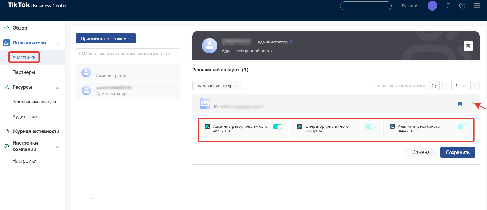
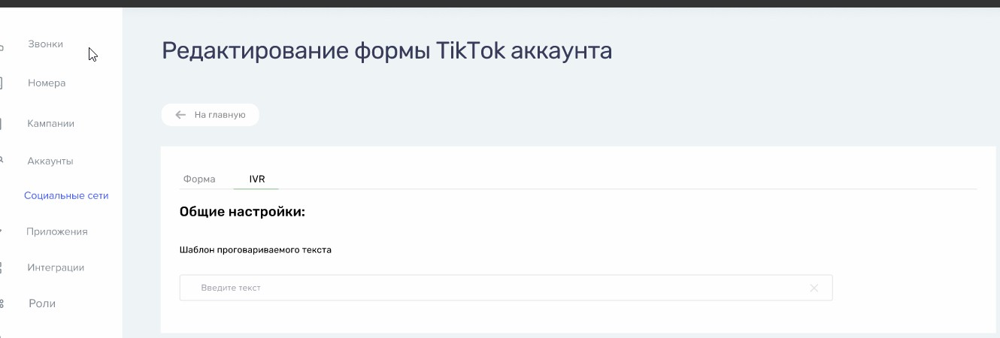
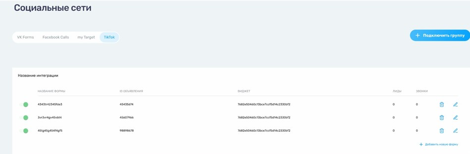

# Настройка интеграции с TikTok LeadAds

## Навигация
* [Описание Виджета ](#Описание-Виджета)
* [Создание Интеграции и нюансы ](#Создание-Интеграции-и-нюансы)
* [Проверка интеграции виджета ](#Проверка-интеграции-виджета)
* [Данные звонков ](#Данные-звонков)
* [Типовые ошибки](#Типовые-ошибки)
* [Инструкция пользователя](#Инструкция-пользователя)

## Описание Виджета
Виджет обратного звонка позволяет автоматически инициировать звонки клиентам, которые заполнили форму в TikTok и оставили в ней свой номер телефона.
Для этого необходимо : 

1) Аккаунт в ТТ.
2) Настроить рекламные кампании и объявления в TikTok For Business, настроить форму обратного звонка, если у Вас они еще не настроены.
3) Активный виджет в личном кабинете CallKeeper.
Подробнее о настройках рекламных кампаний и настройке TikTok Lead Generation  можно прочитать в справочном центре TikTok. [https://ads.tiktok.com/help/article?aid=10001625/](https://ads.tiktok.com/help/article?aid=10001625/)
4) Настроить интеграцию 

## Создание Интеграции и нюансы

**Есть ограничения по уровню доступа** :
- Интеграция возможна только с аккаунтом, которому предоставлен уровень доступа «Администратор».
- У Вас должен быть доступ к привилегиям: **Ads Management;Creative Management;Lead Management**.
Доступы можно проверить на **TikTok Business Centre** : [https://business.tiktok.com/](https://business.tiktok.com/)

Для интеграции виджета необходимо:

- Зайти в личный кабинет CallKeeper. 
- Во вкладке «Социальные Сети» выберите TikTok.

- В открывшейся вкладке в правом верхем углу нажмите «Подключить».

- При подключении аккаунта в новом окне Tik-tok уточнит, под каким аккаунтом Tik-tok вы хотите войти.

- После этого откроется первое окно, на котором будут отображены все страницы Tik-tok, подключенные к аккаунту, под которым вы хотите войти.

- На следующем шаге вам предложат выбрать действия, которые приложение CallKeeper сможет совершать со страницами, которые вы уже выбрали.

Обе настройки рекомендуется сделать активными.

- После этого появится окно настроек страниц CallKeeper. Все страницы, выбранные в этом окне, будут привязаны к вашему аккаунту в CallKeeper.

- Каждое рекламное объявление настраиваться отдельно:

- Пользователь : необходимо выбрать аккаунт с рекламным объявлением
- id объявления : можно найти на сайте [https://www.business-tiktok.com/](https://www.business-tiktok.com/) в своем личном кабинете.
- название формы может быть произвольным
- по желанию можно добавить произвольные значения UTM-меток

- Так же можно добавить шаблон для проговаривания теста :

##  Проверка интеграции виджета

После того как вы настроили ваши кампании и добавили формы лидогенерации, вы можете их проверить до активации кампании.

**Обратите внимание!** В приложении, одним пользователем можно проверить определенную форму только один раз.

Вам необходимо перейти в список объявлений и кликнуть на свернутое меню рядом с "Просмотр данных"
После, в появившимся меню выберите пункт "Preview".

Откроется окно настройки предварительного просмотра на телефоне.

Будет доступно 2 варианта проверки:

1. Через QR-code. 

 Необходимо на вашем устройстве, где установлено приложение TikTok перейти в настройки профиля, перейти в настройки конфиденциальности и выбрать пункт QR-код. Далее в правом верхнем углу нажать на сканирование кода и отсканировать код из рекламного объявления.
После просмотра нескольких роликов, появится рекламный ролик с формой лидогенерации.

2. Через идентификатор пользователя.

 Необходимо на вашем устройстве, где установлено приложение TikTok перейти в настройки профиля, перейти в настройки конфиденциальность.
Далее надо прокрутить все настройки аккаунта до места, где написана версия вашего приложения.
После нескольких кликов на область рядом с версией приложения появятся системные данные. Нам необходимо получить UserId.
Данный UserId вводится в окне предварительного просмотра в рекламном кабинете
После просмотра нескольких роликов, появится рекламный ролик с формой лидогенерации.

## Данные звонков

Звонки по формам из Tik-tok считаются обратными звонками, поэтому информация по ним будет предоставлена в личном кабинете CT во вкладке "Звонки".

Вся информация по звонку отображается в личном кабинете, её можно отфильтровать по нужным параметрам на странице ЛК СТ вкладка "звонки" - Фильтр.

Информация по каждому звонку показана на скриншоте ниже.

Так же информация будет предоставлена во вкладке ЛК СТ "социальные сети" - Tik-tok по количеству лидов и звонков с каждой формы.

## Типовые ошибки

 Ошибка : Нет доступа к аккаунту пользователя или не хватает прав для работы интеграции. 

Вариант исправления : Обновите токен в настройках интеграции TikTok Leads и включите виджет.

 Ошибка : Виджет настроен неверно.

Вариант исправления : Проверить настройки виджета или повторить настройку.

 Ошибка : Удалена интеграция ID..., которая использовалась в виджете №...

Вариант исправления : Создайте новую интеграцию с TikTok Leads и выберите ее в настройках виджета.

## Инструкция пользователя

 При просмотре видео в Tik-tok у пользователя будет появляться рекламное видео внизу которого будет кнопка для перехода на форму для ввода данных. 
 
Алгоритм действий пользователя:
- нажать на кнопку внижней части экрана для перехода на страницу формы обратного звонка.
- заполнить информацию в окне ввода.
- получить обратный звонок.

[Вернуться к оглавлению](#навигация)

[Вернуться на главную](/README.md/#documentation)