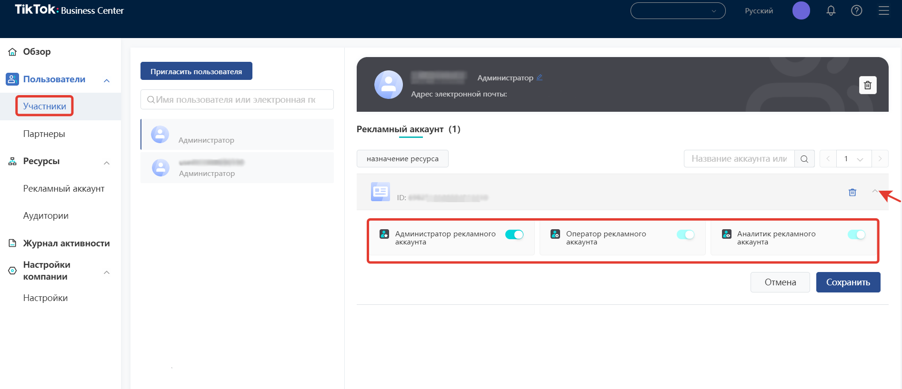
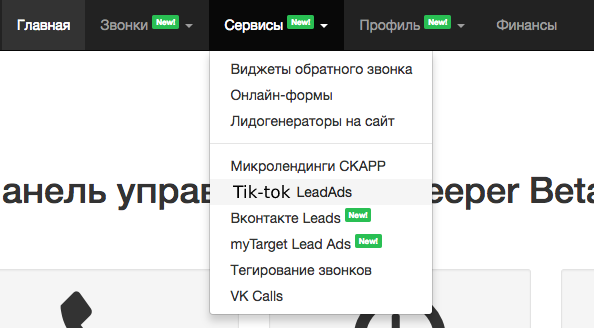
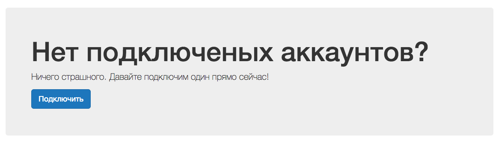

# Настройка интеграции с TikTok LeadAds

## Навигация
* [Описание Виджета ](#Описание-Витжета)
* [Создание Интеграции и нюансы ](#Создание-Интеграции-и-нюансы)
* [Интеграция виджета](#Интеграция-виджета)
* [Проверка интеграции виджета ](#Проверка-интеграции-витжета)
* [Данные заявок](#Данные-заявок)
* [Типовые ошибки](#Типовые-ошибки)
* [Инструкция пользовотеля](#Инструкция-пользовотеля)

## Описание Виджета
Виджет обратного звонка позволяет автоматически инициировать звонки клиентам, которые заполнили форму в TikTok и оставили в ней свой номер телефона.
Для этого необходимо : 

1) Аккаунт в ТТ.
2) Настроить рекламные кампании и объявления в TikTok For Business, настроить мгновенную форму, если у Вас они еще не настроены.
3) Активный виджет в личном кабинете CallKeeper.
Подробнее о настройках рекламных кампаний и настройке TikTok Lead Generation  можно прочитать в справочном центре TikTok. [https://ads.tiktok.com/help/article?aid=10001625/](https://ads.tiktok.com/help/article?aid=10001625/#_=_)
4) Настроить интеграцию 

## Создание Интеграции и нюансы

**Есть ограничения по уровню доступа** :
- Интеграция возможна только с аккаунтом, которому предоставлен уровень доступа «Администратор».
- У Вас должен быть доступ к привилегиям: **Ads Management;Creative Management;Lead Management**.
Доступы можно проверить на TikTok Business Centre : [https://business.tiktok.com/](https://business.tiktok.com/#_=_)

Для интеграции виджета необходимо:
Зайти в ЛК CallKeeper. Во вкладке «Сервисы» выберите TikTok LeadAds.

В открывшейся вкладке нажмите «Подключить».

При подключении аккаунта в новом окне Tik-tok уточнит, под каким аккаунтом Tik-tok вы хотите залогиниться.

После этого откроется первое окно, на котором будут отображены все страницы Tik-tok, подключенные к аккаунту, под которым вы залогинились.

На следующем шаге вам предложат выбрать действия, которые приложение CallKeeper сможет совершать со страницами, которые вы уже выбрали.

Обе настройки рекомендуется сделать активными.

После этого появится окно настроек страниц CallKeeper. Все страницы, выбранные в этом окне, будут привязаны к вашему аккаунту в CallKeeper.

Все созданные формы для выбранной страницы загрузятся в конструкторе, и вам останется выбрать соответствующий виджет, из которого берутся все настройки

Далее обязательный выбор поля, где содержится номер клиента, и по желанию можно добавить произвольные значения UTM-меток и текст для проговаривания.

##  Проверка интеграции виджета

После того, как вы настроили ваши кампании и добавили формы лидогенерации, вы можете их проверить до активации кампании.

**Обратите внимание!** В приложении, одним пользователем можно проверить определенную форму только один раз.

Вам необходимо перейти в список объявлений и кликнуть на свернутое меню рядом с "Просмотр данных"
После, в появившимся меню выберите пункт "Preview".

Откроется окно настройки предварительного просмотра на телефоне.

Будет доступно 2 варианта проверки:

1. Через QR-code.  Необходимо на вашем устройстве, где установлено приложение TikTok перейти в настройки профиля, перейти в настройки конфиденциальности и выбрать пункт QR-код. Далее в правом верхнем углу нажать на сканирование кода и отсканировать код из рекламного объявления.
После просмотра нескольких роликов, появится рекламный ролик с формой лидогенерации.

2. Через идентификатор пользователя.

Необходимо на вашем устройстве, где установлено приложение TikTok перейти в настройки профиля, перейти в настройки конфиденциальность.
Далее надо прокрутить все настройки аккаунта до места, где написана версия вашего приложения.
После нескольких кликов на область рядом с версией приложения появятся системные данные. Нам необходимо получить UserId.
Данный UserId вводится в окне предварительного просмотра в рекламном кабинете
После просмотра нескольких роликов, появится рекламный ролик с формой лидогенерации.

## Метрики Виджета

( уточнить данные о журналах , тестах , метриках , таблицы и данные)

## Типовые ошибки

 Ошибка : Нет доступа к аккаунту пользователя или не хватает прав для работы интеграции. 
Вариант исправления : Обновите токен в настройках интеграции TikTok Leads и включите виджет.

 Ошибка : Удалена интеграция ID..., которая использовалась в виджете №...
Вариант исправления : Создайте новую интеграцию с TikTok Leads и выберите ее в настройках виджета. 

## Инструкция пользовотеля

[Вернуться к оглавлению](#навигация)

[Вернуться на главную](/README.md/#documentation)