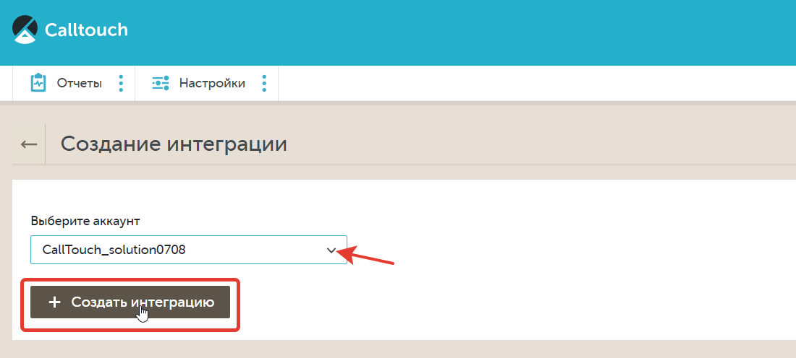
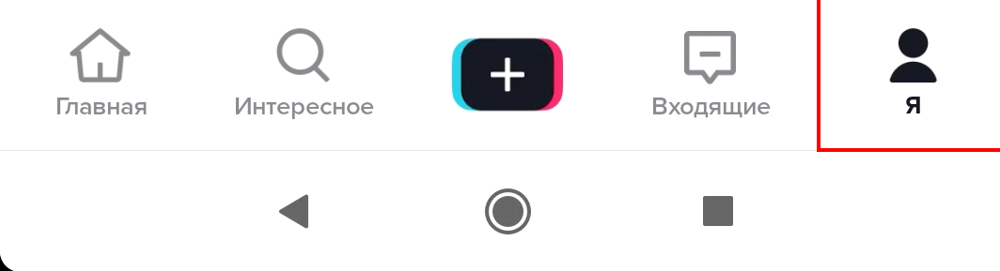
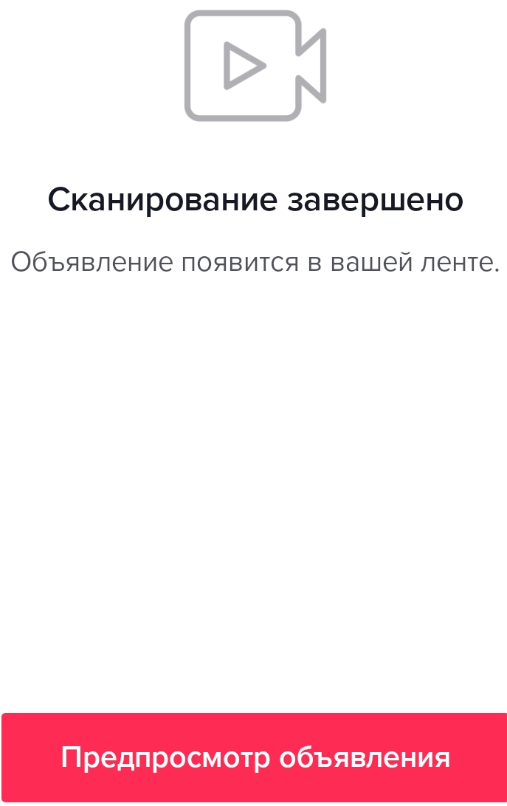
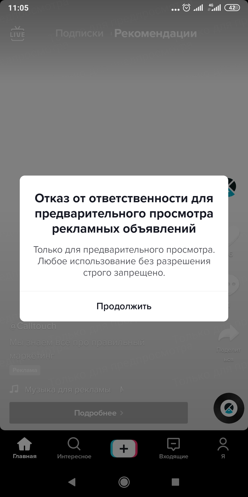

# Настройка интеграции с TikTok LeadAds

## Навигация
* [Описание Витжета ](#Описание-Витжета)
* [Создание Интеграции и нюансы ](#Создание-Интеграции-и-нюансы)
* [Создание Виджета  ](#Создание-Виджета)
* [Возможные кейсы](#Возможные-кейсы)
* [Проверка интеграции витжета ](#Проверка-интеграции-витжета)
* [Данные заявок](#Данные-заявок)
* [Типовые ошибки](#Типовые-ошибки)
* [Интеграция с CallKeeper](#Интеграция-с-CallKeeper)

## Описание Витжета
Виджет обратного звонка позволяет автоматически инициировать звонки клиентам, которые заполнили форму в TikTok и оставили в ней свой номер телефона.
Для этого необходимо : 

1) Аккаунт в ТТ.
2) Настроить рекламные кампании и объявления в TikTok For Business, настроить мгновенную форму, если у Вас они еще не настроены.
3) Активный виджет в ЛК CallKeeper.
Подробнее о настройках рекламных кампаний и настройке TikTok Lead Generation  можно прочитать в справочном центре TikTok. [https://ads.tiktok.com/help/article?aid=10001625/](https://ads.tiktok.com/help/article?aid=10001625/#_=_)
4) Настроить интеграцию 

## Создание Интеграции и нюансы

Есть ограничения по уровню доступа :
- Интеграция возможна только с аккаунтом, которому предоставлен уровень доступа «Администратор».
- У Вас должен быть доступ к привилегиям: Ads Management;Creative Management;Lead Management.
Доступы можно проверить на TikTok Business Centre : [https://business.tiktok.com/](https://business.tiktok.com/#_=_)

После подтверждения, вы будете автоматически перенаправлены в интерфейс для продолжения настроек интеграции.  
Выберите аккаунт и кликните "Создать интеграцию" @@@Заменить СКРИН!!@@@

# Пользовательские названия канала и источника 
(Уточнить Процедуру) 
По умолчанию мы задаем системные названия для канала и источника. Вы можете заменить их на собственные. 
Тогда во всех отчетах лиды с этого аккаунта будут закреплены за вашим вариантом названия канала и источника. 
Обратите внимание! Замена названий произойдет с момента их изменения. Старые данные не поменяются.

## Создание виджета 
(необходимы скрины и информация)

## Возможные кейсы
(узнать информацию Статья + скрины)

##  Проверка интеграции витжета

После того, как вы настроили ваши кампании и добавили формы лидогенерации, вы можете их проверить до активации кампании.

Обратите внимание! В приложении, одним пользователем можно проверить определенную форму только один раз.

Вам необходимо перейти в список объявлений и кликнуть на свернутое меню рядом с "Просмотр данных"
После, в появившимся меню выберите пункт "Preview".

Откроется окно настройки предварительного просмотра на телефоне.

Будет доступно 2 варианта проверки:

1. Через QR-code.  Необходимо на вашем устройстве, где установлено приложение TikTok перейти в настройки профиля, перейти в настройки конфиденциальности и выбрать пункт QR-код. Далее в правом верхнем углу нажать на сканирование кода и отсканировать код из рекламного объявления.
После просмотра нескольких роликов, появится рекламный ролик с формой лидогенерации.

(Добавить 2 последних скрина. переделать все остальные).

2. Через идентификатор пользователя.

Необходимо на вашем устройстве, где установлено приложение TikTok перейти в настройки профиля, перейти в настройки конфиденциальность.
Далее надо прокрутить все настройки аккаунта до места, где написана версия вашего приложения.
После нескольких кликов на область рядом с версией приложения появятся системные данные. Нам необходимо получить UserId.
Данный UserId вводится в окне предварительного просмотра в рекламном кабинете
После просмотра нескольких роликов, появится рекламный ролик с формой лидогенерации.
(сделать новые скрины)

## Данные заявок

( уточнить данные о журналах , тестах , метриках , таблицы и данные)

## Типовые ошибки

 Ошибка : Нет доступа к аккаунту пользователя или не хватает прав для работы интеграции. 
Обновите токен в настройках интеграции TikTok Leads и включите виджет №....

Вариант исправления : Обновите токен в настройках интеграции TikTok Leads и включите виджет // скрины

 Ошибка : Удалена интеграция ID..., которая использовалась в виджете №...
Создайте новую интеграцию с TikTok Leads и выберите ее в настройках виджета.

Вариант исправления : Создайте новую интеграцию с TikTok Leads и выберите ее в настройках виджета. // поясняющие скрины.

## Интеграция с CallKeeper

Зайдите в ЛК CallKeeper. Во вкладке «Сервисы» выберите "название Витжета".
